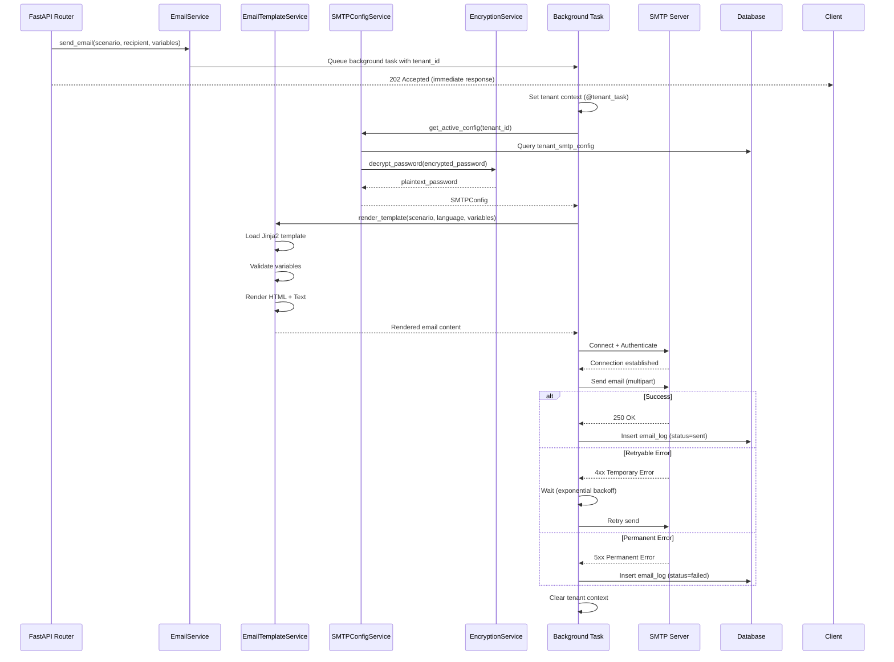
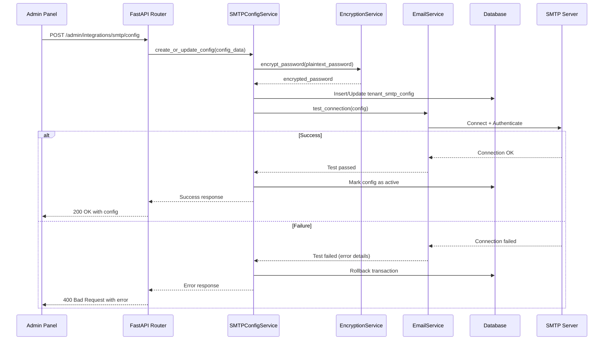

# Design Document: SMTP Email Integration

## Overview

This design document specifies the technical architecture for implementing a comprehensive SMTP-based email integration system for the X-Ear CRM platform. The system enables tenant-specific email configuration, automated email sending for critical business scenarios, comprehensive audit logging, and administrative management through the Admin Panel.

### Key Design Goals

1. **Tenant Isolation**: Strict multi-tenancy with tenant-scoped SMTP configurations and email logs
2. **Security**: AES-256-GCM encryption for SMTP passwords, secure credential management
3. **Reliability**: Asynchronous sending with retry logic, comprehensive error handling
4. **Auditability**: Complete audit trail of all email operations
5. **Maintainability**: Template-based email content with Jinja2, clean separation of concerns
6. **Fail-Safe**: Email failures do not cascade to other system components
7. **Performance**: Background task processing, connection pooling, efficient database queries

### Technology Stack

- **Backend Framework**: FastAPI (Python 3.11+)
- **SMTP Library**: aiosmtplib (async SMTP client)
- **Template Engine**: Jinja2
- **Encryption**: cryptography (Fernet for AES-256-GCM)
- **Background Tasks**: FastAPI BackgroundTasks (Phase 1), Celery (Phase 2)
- **Database**: PostgreSQL with SQLAlchemy ORM
- **API Contract**: OpenAPI 3.0 → Pydantic schemas → Orval code generation
- **Frontend**: React + TypeScript + TanStack Query (via Orval hooks)

## Architecture

### High-Level Architecture

```
┌─────────────────────────────────────────────────────────────────┐
│                        Admin Panel (React)                       │
│  - SMTP Configuration Form                                       │
│  - Email Logs Viewer                                             │
│  - Manual Email Composer                                         │
└────────────────────┬────────────────────────────────────────────┘
                     │ HTTPS (Orval-generated hooks)
                     ▼
┌─────────────────────────────────────────────────────────────────┐
│                    FastAPI Backend                               │
│  ┌──────────────────────────────────────────────────────────┐   │
│  │  Routers (/admin/integrations/smtp/*, /admin/emails/*)  │   │
│  └────────────────────┬─────────────────────────────────────┘   │
│                       │                                          │
│  ┌────────────────────▼─────────────────────────────────────┐   │
│  │              Services Layer                              │   │
│  │  - SMTPConfigService (CRUD + encryption)                 │   │
│  │  - EmailService (send + retry + audit)                   │   │
│  │  - EmailTemplateService (Jinja2 rendering)               │   │
│  │  - EncryptionService (AES-256-GCM)                       │   │
│  └────────────────────┬─────────────────────────────────────┘   │
│                       │                                          │
│  ┌────────────────────▼─────────────────────────────────────┐   │
│  │              Database Models                             │   │
│  │  - TenantSMTPConfig                                      │   │
│  │  - EmailLog                                              │   │
│  │  - EmailTemplate                                         │   │
│  └──────────────────────────────────────────────────────────┘   │
└─────────────────────┬───────────────────────────────────────────┘
                      │
                      ▼
┌─────────────────────────────────────────────────────────────────┐
│                   PostgreSQL Database                            │
│  - tenant_smtp_config (encrypted passwords)                     │
│  - email_log (audit trail)                                      │
│  - email_template (Jinja2 templates)                            │
└─────────────────────────────────────────────────────────────────┘
                      │
                      ▼
┌─────────────────────────────────────────────────────────────────┐
│                External SMTP Server                              │
│  (mail.x-ear.com:465 or tenant-specific)                        │
└─────────────────────────────────────────────────────────────────┘
```


### Component Interaction Flow

#### Email Sending Flow




#### SMTP Configuration Flow



### Tenant Context Management

The email system must maintain strict tenant isolation using ContextVar-based tenant context:

```python
# Background task decorator ensures tenant context
@tenant_task
def send_email_task(*, tenant_id: str, scenario: str, recipient: str, variables: dict):
    # tenant_id is automatically set in context by decorator
    # All database queries are automatically filtered by tenant_id
    config = smtp_config_service.get_active_config()  # Implicitly uses tenant_id
    # ... send email ...
    # Context is automatically cleared after task completion
```

**Critical Rules:**
1. ALL background tasks MUST use `@tenant_task` decorator
2. `tenant_id` MUST be keyword-only parameter
3. NEVER use `set_current_tenant_id(None)` - use token-based reset
4. NEVER use `asyncio.gather()` in routers - use `gather_with_tenant_context()`


## Components and Interfaces

### 1. Database Models

#### TenantSMTPConfig Model

```python
class TenantSMTPConfig(Base):
    """Tenant-specific SMTP configuration with encrypted password."""
    __tablename__ = "tenant_smtp_config"
    
    id: Mapped[str] = mapped_column(String(36), primary_key=True, default=lambda: str(uuid4()))
    tenant_id: Mapped[str] = mapped_column(String(36), ForeignKey("tenants.id"), nullable=False, index=True)
    host: Mapped[str] = mapped_column(String(255), nullable=False)
    port: Mapped[int] = mapped_column(Integer, nullable=False)
    username: Mapped[str] = mapped_column(String(255), nullable=False)
    encrypted_password: Mapped[str] = mapped_column(Text, nullable=False)  # AES-256-GCM encrypted
    from_email: Mapped[str] = mapped_column(String(255), nullable=False)
    from_name: Mapped[str] = mapped_column(String(255), nullable=False)
    use_tls: Mapped[bool] = mapped_column(Boolean, default=False)
    use_ssl: Mapped[bool] = mapped_column(Boolean, default=True)
    timeout: Mapped[int] = mapped_column(Integer, default=30)
    is_active: Mapped[bool] = mapped_column(Boolean, default=True, index=True)
    created_at: Mapped[datetime] = mapped_column(DateTime(timezone=True), default=func.now())
    updated_at: Mapped[datetime] = mapped_column(DateTime(timezone=True), default=func.now(), onupdate=func.now())
    
    # Relationships
    tenant: Mapped["Tenant"] = relationship("Tenant", back_populates="smtp_configs")
    
    # Indexes
    __table_args__ = (
        Index("ix_tenant_smtp_config_tenant_active", "tenant_id", "is_active"),
    )
```

#### EmailLog Model

```python
class EmailLog(Base):
    """Audit log for all email sending attempts."""
    __tablename__ = "email_log"
    
    id: Mapped[str] = mapped_column(String(36), primary_key=True, default=lambda: str(uuid4()))
    tenant_id: Mapped[str] = mapped_column(String(36), ForeignKey("tenants.id"), nullable=False, index=True)
    recipient: Mapped[str] = mapped_column(String(255), nullable=False, index=True)
    subject: Mapped[str] = mapped_column(String(500), nullable=False)
    body_preview: Mapped[str] = mapped_column(Text, nullable=True)  # First 500 chars
    status: Mapped[str] = mapped_column(String(20), nullable=False, index=True)  # sent, failed, bounced
    sent_at: Mapped[datetime] = mapped_column(DateTime(timezone=True), nullable=True, index=True)
    error_message: Mapped[str] = mapped_column(Text, nullable=True)
    retry_count: Mapped[int] = mapped_column(Integer, default=0)
    template_name: Mapped[str] = mapped_column(String(100), nullable=True)
    scenario: Mapped[str] = mapped_column(String(100), nullable=True)  # password_reset, user_invite, etc.
    created_at: Mapped[datetime] = mapped_column(DateTime(timezone=True), default=func.now())
    
    # Relationships
    tenant: Mapped["Tenant"] = relationship("Tenant")
    
    # Indexes
    __table_args__ = (
        Index("ix_email_log_tenant_status_sent", "tenant_id", "status", "sent_at"),
    )
```

#### EmailTemplate Model

```python
class EmailTemplate(Base):
    """Email templates with Jinja2 syntax."""
    __tablename__ = "email_template"
    
    id: Mapped[str] = mapped_column(String(36), primary_key=True, default=lambda: str(uuid4()))
    name: Mapped[str] = mapped_column(String(100), nullable=False, index=True)  # password_reset, user_invite
    language_code: Mapped[str] = mapped_column(String(5), nullable=False, index=True)  # tr, en
    subject_template: Mapped[str] = mapped_column(String(500), nullable=False)
    html_template: Mapped[str] = mapped_column(Text, nullable=False)
    text_template: Mapped[str] = mapped_column(Text, nullable=False)
    variables_schema: Mapped[dict] = mapped_column(JSON, nullable=False)  # JSON schema for validation
    created_at: Mapped[datetime] = mapped_column(DateTime(timezone=True), default=func.now())
    updated_at: Mapped[datetime] = mapped_column(DateTime(timezone=True), default=func.now(), onupdate=func.now())
    
    # Indexes
    __table_args__ = (
        Index("ix_email_template_name_lang", "name", "language_code", unique=True),
    )
```


### 2. Pydantic Schemas

All schemas use `AppBaseModel` with `alias_generator=to_camel` for camelCase JSON fields.

#### SMTP Configuration Schemas

```python
class SMTPConfigBase(AppBaseModel):
    """Base schema for SMTP configuration."""
    host: str = Field(..., min_length=1, max_length=255, description="SMTP server hostname or IP")
    port: int = Field(..., ge=1, le=65535, description="SMTP server port")
    username: str = Field(..., min_length=1, max_length=255, description="SMTP authentication username")
    from_email: EmailStr = Field(..., description="From email address")
    from_name: str = Field(..., min_length=1, max_length=255, description="From display name")
    use_tls: bool = Field(default=False, description="Use STARTTLS")
    use_ssl: bool = Field(default=True, description="Use SSL/TLS")
    timeout: int = Field(default=30, ge=5, le=120, description="Connection timeout in seconds")

class SMTPConfigCreate(SMTPConfigBase):
    """Schema for creating SMTP configuration."""
    password: str = Field(..., min_length=1, description="SMTP authentication password (will be encrypted)")

class SMTPConfigUpdate(SMTPConfigBase):
    """Schema for updating SMTP configuration."""
    password: str | None = Field(None, description="SMTP authentication password (optional, will be encrypted)")

class SMTPConfigResponse(SMTPConfigBase):
    """Schema for SMTP configuration response."""
    id: str
    tenant_id: str
    is_active: bool
    created_at: datetime
    updated_at: datetime
    # Note: password is NEVER included in response

class TestEmailRequest(AppBaseModel):
    """Schema for test email request."""
    recipient: EmailStr = Field(..., description="Test email recipient")
    
class TestEmailResponse(AppBaseModel):
    """Schema for test email response."""
    success: bool
    message: str
    sent_at: datetime | None = None
```

#### Email Sending Schemas

```python
class SendEmailRequest(AppBaseModel):
    """Schema for manual email sending."""
    recipients: list[EmailStr] = Field(..., min_items=1, max_items=100, description="Email recipients")
    subject: str = Field(..., min_length=1, max_length=500, description="Email subject")
    body_html: str = Field(..., min_length=1, description="HTML email body")
    body_text: str | None = Field(None, description="Plain text email body (optional)")
    template_name: str | None = Field(None, description="Template name if using template")
    template_variables: dict[str, Any] | None = Field(None, description="Template variables")

class SendEmailResponse(AppBaseModel):
    """Schema for email sending response."""
    email_ids: list[str] = Field(..., description="Email log IDs for tracking")
    queued_count: int = Field(..., description="Number of emails queued for sending")
    message: str = Field(..., description="Status message")
```

#### Email Log Schemas

```python
class EmailLogResponse(AppBaseModel):
    """Schema for email log response."""
    id: str
    tenant_id: str
    recipient: str
    subject: str
    body_preview: str | None
    status: str  # sent, failed, bounced
    sent_at: datetime | None
    error_message: str | None
    retry_count: int
    template_name: str | None
    scenario: str | None
    created_at: datetime

class EmailLogListRequest(AppBaseModel):
    """Schema for email log list request with filters."""
    page: int = Field(default=1, ge=1, description="Page number")
    per_page: int = Field(default=25, ge=10, le=100, description="Items per page")
    status: str | None = Field(None, description="Filter by status")
    recipient: str | None = Field(None, description="Filter by recipient email")
    date_from: datetime | None = Field(None, description="Filter by date from")
    date_to: datetime | None = Field(None, description="Filter by date to")

class EmailLogListResponse(AppBaseModel):
    """Schema for email log list response."""
    items: list[EmailLogResponse]
    total: int
    page: int
    per_page: int
    total_pages: int
```


### 3. Services Layer

#### EncryptionService

```python
class EncryptionService:
    """Service for encrypting/decrypting sensitive data using AES-256-GCM (Fernet)."""
    
    def __init__(self):
        encryption_key = os.getenv("SMTP_ENCRYPTION_KEY")
        if not encryption_key:
            raise ConfigurationError("SMTP_ENCRYPTION_KEY environment variable is required")
        self.fernet = Fernet(encryption_key.encode())
    
    def encrypt_password(self, plaintext: str) -> str:
        """Encrypt password using AES-256-GCM.
        
        Returns base64-encoded encrypted string with embedded nonce and auth tag.
        """
        encrypted_bytes = self.fernet.encrypt(plaintext.encode())
        return encrypted_bytes.decode()
    
    def decrypt_password(self, encrypted: str) -> str:
        """Decrypt password using AES-256-GCM.
        
        Raises:
            InvalidToken: If authentication tag validation fails
        """
        try:
            decrypted_bytes = self.fernet.decrypt(encrypted.encode())
            return decrypted_bytes.decode()
        except InvalidToken:
            logger.error("Password decryption failed - invalid authentication tag")
            raise SecurityException("Failed to decrypt SMTP password")
```

#### SMTPConfigService

```python
class SMTPConfigService:
    """Service for managing tenant SMTP configurations."""
    
    def __init__(self, db: Session, encryption_service: EncryptionService):
        self.db = db
        self.encryption_service = encryption_service
    
    def create_or_update_config(
        self, 
        config_data: SMTPConfigCreate, 
        tenant_id: str
    ) -> TenantSMTPConfig:
        """Create or update SMTP configuration for tenant.
        
        Encrypts password before storage and validates configuration.
        """
        # Encrypt password
        encrypted_password = self.encryption_service.encrypt_password(config_data.password)
        
        # Check for existing active config
        existing = self.db.query(TenantSMTPConfig).filter(
            TenantSMTPConfig.tenant_id == tenant_id,
            TenantSMTPConfig.is_active == True
        ).first()
        
        if existing:
            # Update existing
            for field, value in config_data.model_dump(exclude={"password"}).items():
                setattr(existing, field, value)
            existing.encrypted_password = encrypted_password
            existing.updated_at = func.now()
            config = existing
        else:
            # Create new
            config = TenantSMTPConfig(
                tenant_id=tenant_id,
                encrypted_password=encrypted_password,
                **config_data.model_dump(exclude={"password"})
            )
            self.db.add(config)
        
        self.db.flush()
        return config
    
    def get_active_config(self, tenant_id: str) -> TenantSMTPConfig | None:
        """Get active SMTP configuration for tenant.
        
        Returns None if no active config exists (will use global fallback).
        """
        return self.db.query(TenantSMTPConfig).filter(
            TenantSMTPConfig.tenant_id == tenant_id,
            TenantSMTPConfig.is_active == True
        ).order_by(TenantSMTPConfig.created_at.desc()).first()
    
    def get_config_with_decrypted_password(
        self, 
        tenant_id: str
    ) -> dict | None:
        """Get SMTP config with decrypted password for email sending.
        
        Returns dict with plaintext password for SMTP connection.
        """
        config = self.get_active_config(tenant_id)
        if not config:
            return self._get_global_fallback_config()
        
        return {
            "host": config.host,
            "port": config.port,
            "username": config.username,
            "password": self.encryption_service.decrypt_password(config.encrypted_password),
            "from_email": config.from_email,
            "from_name": config.from_name,
            "use_tls": config.use_tls,
            "use_ssl": config.use_ssl,
            "timeout": config.timeout
        }
    
    def _get_global_fallback_config(self) -> dict:
        """Get global SMTP configuration from environment variables."""
        return {
            "host": os.getenv("SMTP_HOST", "mail.x-ear.com"),
            "port": int(os.getenv("SMTP_PORT", "465")),
            "username": os.getenv("SMTP_USER", "info@x-ear.com"),
            "password": os.getenv("SMTP_PASS", ""),
            "from_email": os.getenv("SMTP_FROM_EMAIL", "info@x-ear.com"),
            "from_name": os.getenv("SMTP_FROM_NAME", "X-Ear CRM"),
            "use_tls": os.getenv("SMTP_USE_TLS", "false").lower() == "true",
            "use_ssl": os.getenv("SMTP_USE_SSL", "true").lower() == "true",
            "timeout": int(os.getenv("SMTP_TIMEOUT", "30"))
        }
    
    def validate_config(self, config_data: SMTPConfigCreate) -> tuple[bool, str]:
        """Validate SMTP configuration fields.
        
        Returns (is_valid, error_message).
        """
        # Validate port ranges for SSL/TLS
        if config_data.use_ssl and config_data.port not in [465, 587]:
            return False, "SSL typically uses port 465"
        
        if config_data.use_tls and config_data.port not in [587, 25]:
            return False, "TLS typically uses port 587 or 25"
        
        # Validate email format
        try:
            validate_email(config_data.from_email)
        except EmailNotValidError:
            return False, "Invalid from_email format"
        
        return True, ""
```


#### EmailTemplateService

```python
class EmailTemplateService:
    """Service for rendering email templates using Jinja2."""
    
    def __init__(self):
        self.jinja_env = Environment(
            loader=FileSystemLoader("templates/email"),
            autoescape=select_autoescape(["html", "xml"]),
            trim_blocks=True,
            lstrip_blocks=True
        )
    
    def render_template(
        self,
        scenario: str,
        language: str,
        variables: dict[str, Any]
    ) -> tuple[str, str, str]:
        """Render email template for scenario and language.
        
        Returns (subject, html_body, text_body).
        
        Raises:
            TemplateNotFound: If template doesn't exist
            TemplateError: If template rendering fails
            ValidationError: If required variables are missing
        """
        # Determine language with fallback
        lang = self._resolve_language(scenario, language)
        
        # Load templates
        try:
            html_template = self.jinja_env.get_template(f"{lang}/{scenario}.html")
            text_template = self.jinja_env.get_template(f"{lang}/{scenario}.txt")
            subject_template = self._load_subject_template(scenario, lang)
        except TemplateNotFound:
            logger.error(f"Template not found: {scenario} ({lang})")
            raise TemplateError(f"Email template not found: {scenario}")
        
        # Validate required variables
        self._validate_variables(scenario, variables)
        
        # Add common variables
        context = {
            **variables,
            "current_year": datetime.now().year,
            "app_name": "X-Ear CRM",
            "support_email": "destek@x-ear.com"
        }
        
        # Render templates
        try:
            subject = subject_template.render(**context)
            html_body = html_template.render(**context)
            text_body = text_template.render(**context)
        except Exception as e:
            logger.error(f"Template rendering failed: {e}")
            raise TemplateError(f"Failed to render template: {str(e)}")
        
        return subject, html_body, text_body
    
    def _resolve_language(self, scenario: str, requested_lang: str) -> str:
        """Resolve language with fallback to TR."""
        # Check if requested language template exists
        html_path = f"templates/email/{requested_lang}/{scenario}.html"
        if os.path.exists(html_path):
            return requested_lang
        
        # Fallback to Turkish
        return "tr"
    
    def _load_subject_template(self, scenario: str, lang: str) -> Template:
        """Load subject template from metadata file."""
        metadata_path = f"templates/email/{lang}/{scenario}_meta.json"
        with open(metadata_path, "r", encoding="utf-8") as f:
            metadata = json.load(f)
        return self.jinja_env.from_string(metadata["subject"])
    
    def _validate_variables(self, scenario: str, variables: dict[str, Any]):
        """Validate that all required variables are provided."""
        required_vars = TEMPLATE_REQUIRED_VARIABLES.get(scenario, [])
        missing = [var for var in required_vars if var not in variables]
        if missing:
            raise ValidationError(f"Missing required variables: {', '.join(missing)}")

# Template variable requirements
TEMPLATE_REQUIRED_VARIABLES = {
    "password_reset": ["reset_link", "user_name", "expires_in_hours"],
    "user_invite": ["inviter_name", "organization_name", "invitation_link", "role_name"],
    "email_verification": ["verification_link", "user_name"],
    "invoice_created": ["invoice_number", "amount", "currency", "due_date", "invoice_link"],
    "system_error": ["error_type", "timestamp", "tenant_name", "error_details", "admin_link"]
}
```


#### EmailService

```python
class EmailService:
    """Service for sending emails via SMTP with retry logic and audit logging."""
    
    def __init__(
        self,
        db: Session,
        smtp_config_service: SMTPConfigService,
        template_service: EmailTemplateService
    ):
        self.db = db
        self.smtp_config_service = smtp_config_service
        self.template_service = template_service
    
    def queue_email(
        self,
        scenario: str,
        recipient: str,
        variables: dict[str, str],  # Typed dict, not Any
        tenant_id: str,
        language: str = "tr"
    ) -> str:
        """Queue email for background sending.
        
        Returns email_log_id for tracking.
        This method is synchronous and only creates the log entry.
        Actual sending happens in background task managed by router.
        """
        # Create email log entry
        email_log = EmailLog(
            tenant_id=tenant_id,
            recipient=recipient,
            scenario=scenario,
            template_name=scenario,
            status="pending"
        )
        self.db.add(email_log)
        self.db.flush()
        
        return email_log.id
    
    @tenant_task
    async def send_email_task(
        self,
        *,
        tenant_id: str,
        email_log_id: str,
        scenario: str,
        recipient: str,
        variables: dict[str, str],
        language: str
    ):
        """Background task for sending email with retry logic.
        
        Tenant context is automatically set by @tenant_task decorator.
        This method gets a fresh DB session from dependency injection.
        """
        # Get fresh DB session for background task
        db = next(get_db())
        
        try:
            max_retries = 3
            retry_delays = [2, 4, 8]  # Exponential backoff in seconds
            
            for attempt in range(max_retries + 1):
                try:
                    # Get SMTP configuration
                    smtp_config = self.smtp_config_service.get_config_with_decrypted_password(tenant_id)
                    
                    # Render template
                    subject, html_body, text_body = self.template_service.render_template(
                        scenario, language, variables
                    )
                    
                    # Send email
                    await self._send_smtp(
                        smtp_config=smtp_config,
                        recipient=recipient,
                        subject=subject,
                        html_body=html_body,
                        text_body=text_body
                    )
                    
                    # Update log as successful
                    self._update_email_log(
                        db,
                        email_log_id,
                        status="sent",
                        subject=subject,
                        body_preview=text_body[:500],
                        sent_at=datetime.now(timezone.utc),
                        retry_count=attempt
                    )
                    
                    logger.info(f"Email sent successfully: {email_log_id} (attempt {attempt + 1})")
                    return
                    
                except (SMTPConnectError, SMTPServerDisconnected, asyncio.TimeoutError) as e:
                    # Retryable errors
                    if attempt < max_retries:
                        delay = retry_delays[attempt]
                        logger.warning(f"Email send failed (attempt {attempt + 1}), retrying in {delay}s: {e}")
                        await asyncio.sleep(delay)
                    else:
                        # Max retries exhausted
                        self._update_email_log(
                            db,
                            email_log_id,
                            status="failed",
                            error_message=f"Max retries exhausted: {str(e)}",
                            retry_count=attempt
                        )
                        logger.error(f"Email send failed after {max_retries} retries: {email_log_id}")
                        
                except (SMTPAuthenticationError, SMTPRecipientsRefused) as e:
                    # Non-retryable errors
                    self._update_email_log(
                        db,
                        email_log_id,
                        status="failed",
                        error_message=f"Permanent error: {str(e)}",
                        retry_count=attempt
                    )
                    logger.error(f"Email send failed with permanent error: {email_log_id} - {e}")
                    return
                    
                except Exception as e:
                    # Unexpected errors
                    self._update_email_log(
                        db,
                        email_log_id,
                        status="failed",
                        error_message=f"Unexpected error: {str(e)}",
                        retry_count=attempt
                    )
                    logger.exception(f"Unexpected error sending email: {email_log_id}")
                    return
        finally:
            db.close()
    
    async def _send_smtp(
        self,
        smtp_config: dict,
        recipient: str,
        subject: str,
        html_body: str,
        text_body: str
    ):
        """Send email via SMTP using aiosmtplib."""
        # Create multipart message
        message = MIMEMultipart("alternative")
        message["From"] = f"{smtp_config['from_name']} <{smtp_config['from_email']}>"
        message["To"] = recipient
        message["Subject"] = subject
        message["Date"] = formatdate(localtime=True)
        message["Message-ID"] = make_msgid()
        
        # Attach text and HTML parts
        message.attach(MIMEText(text_body, "plain", "utf-8"))
        message.attach(MIMEText(html_body, "html", "utf-8"))
        
        # Connect and send
        async with SMTP(
            hostname=smtp_config["host"],
            port=smtp_config["port"],
            use_tls=smtp_config["use_ssl"],
            timeout=smtp_config["timeout"]
        ) as smtp:
            if smtp_config["use_tls"] and not smtp_config["use_ssl"]:
                await smtp.starttls()
            
            await smtp.login(smtp_config["username"], smtp_config["password"])
            await smtp.send_message(message)
    
    def _update_email_log(
        self,
        db: Session,
        email_log_id: str,
        status: str,
        subject: str = None,
        body_preview: str = None,
        sent_at: datetime = None,
        error_message: str = None,
        retry_count: int = 0
    ):
        """Update email log entry."""
        email_log = db.get(EmailLog, email_log_id)
        if email_log:
            email_log.status = status
            if subject:
                email_log.subject = subject
            if body_preview:
                email_log.body_preview = body_preview
            if sent_at:
                email_log.sent_at = sent_at
            if error_message:
                email_log.error_message = error_message
            email_log.retry_count = retry_count
            db.commit()
    
    async def test_connection(self, smtp_config: dict) -> tuple[bool, str]:
        """Test SMTP connection and authentication.
        
        Returns (success, message).
        """
        try:
            async with SMTP(
                hostname=smtp_config["host"],
                port=smtp_config["port"],
                use_tls=smtp_config["use_ssl"],
                timeout=smtp_config["timeout"]
            ) as smtp:
                if smtp_config["use_tls"] and not smtp_config["use_ssl"]:
                    await smtp.starttls()
                
                await smtp.login(smtp_config["username"], smtp_config["password"])
                return True, "SMTP connection successful"
                
        except SMTPAuthenticationError:
            return False, "SMTP authentication failed. Please check username and password."
        except (SMTPConnectError, asyncio.TimeoutError):
            return False, "Cannot connect to SMTP server. Please check host and port."
        except Exception as e:
            return False, f"SMTP test failed: {str(e)}"
```


### 4. API Endpoints

All endpoints follow X-Ear CRM conventions:
- ResponseEnvelope wrapper for all responses
- camelCase JSON fields (via Pydantic alias_generator)
- Explicit operationId for Orval code generation
- Idempotency-Key header for POST/PUT/PATCH
- Tenant isolation via middleware

#### SMTP Configuration Endpoints

```python
@router.post(
    "/admin/integrations/smtp/config",
    response_model=ResponseEnvelope[SMTPConfigResponse],
    operation_id="createOrUpdateSMTPConfig",
    dependencies=[Depends(require_access("integrations.smtp.manage"))]
)
async def create_or_update_smtp_config(
    config: SMTPConfigCreate,
    db: Session = Depends(get_db),
    current_user: User = Depends(get_current_user)
) -> ResponseEnvelope[SMTPConfigResponse]:
    """Create or update SMTP configuration for current tenant.
    
    Password is encrypted before storage using AES-256-GCM.
    Configuration is validated by attempting a test connection.
    """
    tenant_id = current_user.tenant_id
    
    # Validate configuration
    smtp_config_service = SMTPConfigService(db, EncryptionService())
    is_valid, error_msg = smtp_config_service.validate_config(config)
    if not is_valid:
        return ResponseEnvelope.error(error_msg, status_code=400)
    
    # Create/update config
    config_model = smtp_config_service.create_or_update_config(config, tenant_id)
    
    # Test connection
    email_service = EmailService(db, smtp_config_service, EmailTemplateService())
    test_config = smtp_config_service.get_config_with_decrypted_password(tenant_id)
    success, message = await email_service.test_connection(test_config)
    
    if not success:
        db.rollback()
        return ResponseEnvelope.error(f"Configuration test failed: {message}", status_code=400)
    
    db.commit()
    
    response_data = SMTPConfigResponse.model_validate(config_model)
    return ResponseEnvelope.success(response_data, message="SMTP configuration saved successfully")


@router.get(
    "/admin/integrations/smtp/config",
    response_model=ResponseEnvelope[SMTPConfigResponse],
    operation_id="getSMTPConfig",
    dependencies=[Depends(require_access("integrations.smtp.view"))]
)
async def get_smtp_config(
    db: Session = Depends(get_db),
    current_user: User = Depends(get_current_user)
) -> ResponseEnvelope[SMTPConfigResponse]:
    """Get active SMTP configuration for current tenant.
    
    Password is never included in response for security.
    """
    tenant_id = current_user.tenant_id
    
    smtp_config_service = SMTPConfigService(db, EncryptionService())
    config = smtp_config_service.get_active_config(tenant_id)
    
    if not config:
        return ResponseEnvelope.error("No SMTP configuration found", status_code=404)
    
    response_data = SMTPConfigResponse.model_validate(config)
    return ResponseEnvelope.success(response_data)


@router.post(
    "/admin/integrations/smtp/test",
    response_model=ResponseEnvelope[TestEmailResponse],
    operation_id="sendTestEmail",
    dependencies=[Depends(require_access("integrations.smtp.test"))]
)
async def send_test_email(
    request: TestEmailRequest,
    background_tasks: BackgroundTasks,  # Injected by FastAPI
    db: Session = Depends(get_db),
    current_user: User = Depends(get_current_user)
) -> ResponseEnvelope[TestEmailResponse]:
    """Send a test email to verify SMTP configuration.
    
    Uses a simple test template with current configuration.
    """
    tenant_id = current_user.tenant_id
    
    # Get SMTP config
    smtp_config_service = SMTPConfigService(db, EncryptionService())
    config = smtp_config_service.get_config_with_decrypted_password(tenant_id)
    
    if not config:
        return ResponseEnvelope.error("No SMTP configuration found", status_code=404)
    
    # Queue email (creates log entry)
    email_service = EmailService(db, smtp_config_service, EmailTemplateService())
    email_log_id = email_service.queue_email(
        scenario="smtp_test",
        recipient=request.recipient,
        variables={
            "user_name": current_user.full_name,
            "tenant_name": current_user.tenant.name
        },
        tenant_id=tenant_id,
        language="tr"
    )
    
    # Add background task (router manages BackgroundTasks lifecycle)
    background_tasks.add_task(
        email_service.send_email_task,
        tenant_id=tenant_id,
        email_log_id=email_log_id,
        scenario="smtp_test",
        recipient=request.recipient,
        variables={
            "user_name": current_user.full_name,
            "tenant_name": current_user.tenant.name
        },
        language="tr"
    )
    
    response_data = TestEmailResponse(
        success=True,
        message="Test email queued successfully",
        sent_at=datetime.now(timezone.utc)
    )
    return ResponseEnvelope.success(response_data)
```


#### Email Log Endpoints

```python
@router.get(
    "/admin/integrations/smtp/logs",
    response_model=ResponseEnvelope[EmailLogListResponse],
    operation_id="getEmailLogs",
    dependencies=[Depends(require_access("integrations.smtp.logs.view"))]
)
async def get_email_logs(
    page: int = Query(1, ge=1),
    per_page: int = Query(25, ge=10, le=100),
    status: str | None = Query(None),
    recipient: str | None = Query(None),
    date_from: datetime | None = Query(None),
    date_to: datetime | None = Query(None),
    db: Session = Depends(get_db),
    current_user: User = Depends(get_current_user)
) -> ResponseEnvelope[EmailLogListResponse]:
    """Get email logs with pagination and filters.
    
    Logs are tenant-scoped and ordered by created_at descending.
    """
    tenant_id = current_user.tenant_id
    
    # Build query with tenant isolation
    query = db.query(EmailLog).filter(EmailLog.tenant_id == tenant_id)
    
    # Apply filters
    if status:
        query = query.filter(EmailLog.status == status)
    if recipient:
        query = query.filter(EmailLog.recipient.ilike(f"%{recipient}%"))
    if date_from:
        query = query.filter(EmailLog.created_at >= date_from)
    if date_to:
        query = query.filter(EmailLog.created_at <= date_to)
    
    # Get total count
    total = query.count()
    
    # Apply pagination
    query = query.order_by(EmailLog.created_at.desc())
    query = query.offset((page - 1) * per_page).limit(per_page)
    
    # Execute query
    logs = query.all()
    
    # Build response
    items = [EmailLogResponse.model_validate(log) for log in logs]
    total_pages = (total + per_page - 1) // per_page
    
    response_data = EmailLogListResponse(
        items=items,
        total=total,
        page=page,
        per_page=per_page,
        total_pages=total_pages
    )
    
    return ResponseEnvelope.success(response_data)


@router.post(
    "/admin/emails/send",
    response_model=ResponseEnvelope[SendEmailResponse],
    operation_id="sendManualEmail",
    dependencies=[Depends(require_access("emails.send"))]
)
async def send_manual_email(
    request: SendEmailRequest,
    background_tasks: BackgroundTasks,
    db: Session = Depends(get_db),
    current_user: User = Depends(get_current_user)
) -> ResponseEnvelope[SendEmailResponse]:
    """Send manual email to one or more recipients.
    
    Supports both direct HTML/text content and template-based sending.
    """
    tenant_id = current_user.tenant_id
    
    smtp_config_service = SMTPConfigService(db, EncryptionService())
    template_service = EmailTemplateService()
    email_service = EmailService(db, smtp_config_service, template_service)
    
    email_ids = []
    
    # Send to each recipient
    for recipient in request.recipients:
        try:
            if request.template_name:
                # Template-based sending
                email_log_id = await email_service.send_email(
                    scenario=request.template_name,
                    recipient=recipient,
                    variables=request.template_variables or {},
                    tenant_id=tenant_id,
                    language="tr"  # TODO: Get from user profile
                )
            else:
                # Direct HTML/text sending
                # TODO: Implement direct sending without template
                pass
            
            email_ids.append(email_log_id)
            
        except Exception as e:
            logger.error(f"Failed to queue email for {recipient}: {e}")
            # Continue with other recipients
    
    response_data = SendEmailResponse(
        email_ids=email_ids,
        queued_count=len(email_ids),
        message=f"Successfully queued {len(email_ids)} of {len(request.recipients)} emails"
    )
    
    return ResponseEnvelope.success(response_data)
```


## Data Models

### Database Schema

#### Alembic Migration

```python
"""Add email system tables

Revision ID: add_email_system
Revises: previous_revision
Create Date: 2025-01-XX
"""

def upgrade():
    # Create tenant_smtp_config table
    op.create_table(
        'tenant_smtp_config',
        sa.Column('id', sa.String(36), primary_key=True),
        sa.Column('tenant_id', sa.String(36), sa.ForeignKey('tenants.id'), nullable=False),
        sa.Column('host', sa.String(255), nullable=False),
        sa.Column('port', sa.Integer, nullable=False),
        sa.Column('username', sa.String(255), nullable=False),
        sa.Column('encrypted_password', sa.Text, nullable=False),
        sa.Column('from_email', sa.String(255), nullable=False),
        sa.Column('from_name', sa.String(255), nullable=False),
        sa.Column('use_tls', sa.Boolean, default=False),
        sa.Column('use_ssl', sa.Boolean, default=True),
        sa.Column('timeout', sa.Integer, default=30),
        sa.Column('is_active', sa.Boolean, default=True),
        sa.Column('created_at', sa.DateTime(timezone=True), server_default=sa.func.now()),
        sa.Column('updated_at', sa.DateTime(timezone=True), server_default=sa.func.now(), onupdate=sa.func.now())
    )
    
    op.create_index('ix_tenant_smtp_config_tenant_id', 'tenant_smtp_config', ['tenant_id'])
    op.create_index('ix_tenant_smtp_config_tenant_active', 'tenant_smtp_config', ['tenant_id', 'is_active'])
    
    # Create email_log table
    op.create_table(
        'email_log',
        sa.Column('id', sa.String(36), primary_key=True),
        sa.Column('tenant_id', sa.String(36), sa.ForeignKey('tenants.id'), nullable=False),
        sa.Column('recipient', sa.String(255), nullable=False),
        sa.Column('subject', sa.String(500), nullable=False),
        sa.Column('body_preview', sa.Text, nullable=True),
        sa.Column('status', sa.String(20), nullable=False),
        sa.Column('sent_at', sa.DateTime(timezone=True), nullable=True),
        sa.Column('error_message', sa.Text, nullable=True),
        sa.Column('retry_count', sa.Integer, default=0),
        sa.Column('template_name', sa.String(100), nullable=True),
        sa.Column('scenario', sa.String(100), nullable=True),
        sa.Column('created_at', sa.DateTime(timezone=True), server_default=sa.func.now())
    )
    
    op.create_index('ix_email_log_tenant_id', 'email_log', ['tenant_id'])
    op.create_index('ix_email_log_recipient', 'email_log', ['recipient'])
    op.create_index('ix_email_log_status', 'email_log', ['status'])
    op.create_index('ix_email_log_sent_at', 'email_log', ['sent_at'])
    op.create_index('ix_email_log_tenant_status_sent', 'email_log', ['tenant_id', 'status', 'sent_at'])
    
    # Create email_template table
    op.create_table(
        'email_template',
        sa.Column('id', sa.String(36), primary_key=True),
        sa.Column('name', sa.String(100), nullable=False),
        sa.Column('language_code', sa.String(5), nullable=False),
        sa.Column('subject_template', sa.String(500), nullable=False),
        sa.Column('html_template', sa.Text, nullable=False),
        sa.Column('text_template', sa.Text, nullable=False),
        sa.Column('variables_schema', sa.JSON, nullable=False),
        sa.Column('created_at', sa.DateTime(timezone=True), server_default=sa.func.now()),
        sa.Column('updated_at', sa.DateTime(timezone=True), server_default=sa.func.now(), onupdate=sa.func.now())
    )
    
    op.create_index('ix_email_template_name', 'email_template', ['name'])
    op.create_index('ix_email_template_language_code', 'email_template', ['language_code'])
    op.create_unique_constraint('uq_email_template_name_lang', 'email_template', ['name', 'language_code'])

def downgrade():
    op.drop_table('email_template')
    op.drop_table('email_log')
    op.drop_table('tenant_smtp_config')
```

### Template File Structure

```
templates/email/
├── base.html                    # Base HTML layout with header/footer
├── base.txt                     # Base text layout
├── tr/                          # Turkish templates
│   ├── password_reset.html
│   ├── password_reset.txt
│   ├── password_reset_meta.json # Subject and metadata
│   ├── user_invite.html
│   ├── user_invite.txt
│   ├── user_invite_meta.json
│   ├── email_verification.html
│   ├── email_verification.txt
│   ├── email_verification_meta.json
│   ├── invoice_created.html
│   ├── invoice_created.txt
│   ├── invoice_created_meta.json
│   ├── system_error.html
│   ├── system_error.txt
│   ├── system_error_meta.json
│   ├── smtp_test.html
│   ├── smtp_test.txt
│   └── smtp_test_meta.json
└── en/                          # English templates (Phase 2)
    └── (same structure as tr/)
```

### Template Example: Password Reset (TR)

**templates/email/tr/password_reset_meta.json:**
```json
{
  "subject": "Şifre Sıfırlama Talebi - {{ app_name }}",
  "required_variables": ["reset_link", "user_name", "expires_in_hours"]
}
```

**templates/email/tr/password_reset.html:**
```html



<h2>Merhaba {{ user_name }},</h2>

<p>Hesabınız için şifre sıfırlama talebinde bulundunuz. Aşağıdaki bağlantıya tıklayarak yeni şifrenizi oluşturabilirsiniz:</p>

<div style="text-align: center; margin: 30px 0;">
  <a href="{{ reset_link }}" style="background-color: #007bff; color: white; padding: 12px 30px; text-decoration: none; border-radius: 5px; display: inline-block;">
    Şifremi Sıfırla
  </a>
</div>

<p>Bu bağlantı <strong>{{ expires_in_hours }} saat</strong> süreyle geçerlidir.</p>

<p>Eğer bu talebi siz yapmadıysanız, bu e-postayı görmezden gelebilirsiniz. Şifreniz değiştirilmeyecektir.</p>

<p>Güvenlik nedeniyle, şifrenizi kimseyle paylaşmayın.</p>

```

**templates/email/tr/password_reset.txt:**
```text
Merhaba {{ user_name }},

Hesabınız için şifre sıfırlama talebinde bulundunuz.

Şifrenizi sıfırlamak için aşağıdaki bağlantıya tıklayın:
{{ reset_link }}

Bu bağlantı {{ expires_in_hours }} saat süreyle geçerlidir.

Eğer bu talebi siz yapmadıysanız, bu e-postayı görmezden gelebilirsiniz.

--
{{ app_name }}
{{ support_email }}
```


## Correctness Properties

*A property is a characteristic or behavior that should hold true across all valid executions of a system—essentially, a formal statement about what the system should do. Properties serve as the bridge between human-readable specifications and machine-verifiable correctness guarantees.*

### Property 1: Encryption Round-Trip Consistency

*For any* plaintext SMTP password, encrypting then decrypting should produce the original password value.

**Validates: Requirements 1.1, 2.1, 2.5**

### Property 2: Encryption Uniqueness

*For any* plaintext password, encrypting it multiple times should produce different ciphertext values (due to unique nonces), but all should decrypt to the same plaintext.

**Validates: Requirements 2.4**

### Property 3: Tenant Isolation for SMTP Configurations

*For any* tenant, querying SMTP configurations should only return configurations where tenant_id matches the querying tenant, never configurations from other tenants.

**Validates: Requirements 1.4, 18.1, 18.4**

### Property 4: Tenant Isolation for Email Logs

*For any* tenant, querying email logs should only return logs where tenant_id matches the querying tenant, never logs from other tenants.

**Validates: Requirements 5.7, 18.2, 18.4**

### Property 5: Most Recent Active Configuration Selection

*For any* tenant with multiple SMTP configurations, the system should select the configuration with the most recent created_at timestamp where is_active is true.

**Validates: Requirements 1.7**

### Property 6: Async Email Queueing

*For any* email send request, the send_email method should return immediately (within 100ms) without waiting for SMTP operations to complete.

**Validates: Requirements 3.1**

### Property 7: Multipart Message Format

*For any* email sent by the system, the SMTP message should contain both a plain text part and an HTML part.

**Validates: Requirements 3.3**

### Property 8: Tenant Context Cleanup

*For any* background email task, after task completion (success or failure), the tenant context should be cleared (None).

**Validates: Requirements 3.5, 18.6**

### Property 9: Retry Behavior for Retryable Errors

*For any* email send that fails with a retryable error (connection timeout, connection refused, 4xx SMTP codes), the system should retry up to 3 times before marking as failed.

**Validates: Requirements 4.1, 4.3, 4.5**

### Property 10: No Retry for Permanent Errors

*For any* email send that fails with a non-retryable error (authentication failure, invalid recipient, 5xx SMTP codes), the system should not retry and should immediately mark as failed.

**Validates: Requirements 4.4**

### Property 11: Retry Count Logging

*For any* email that succeeds after retries, the email_log record should contain the accurate retry_count value.

**Validates: Requirements 4.6**

### Property 12: Audit Log Creation

*For any* email send attempt (successful or failed), an email_log record should be created with tenant_id, recipient, subject, and status fields populated.

**Validates: Requirements 5.1, 5.2**

### Property 13: Successful Send Logging

*For any* successfully sent email, the email_log record should have status="sent" and sent_at timestamp populated.

**Validates: Requirements 5.3**

### Property 14: Failed Send Logging

*For any* email that fails after all retries, the email_log record should have status="failed" and error_message populated with failure details.

**Validates: Requirements 5.4**

### Property 15: Template Rendering Completeness

*For any* supported scenario (password_reset, user_invite, email_verification, invoice_created, system_error), the template service should render both HTML and plain text versions.

**Validates: Requirements 6.2**

### Property 16: Base Layout Inclusion

*For any* rendered email template, the HTML output should contain base layout elements (header and footer).

**Validates: Requirements 6.3**

### Property 17: Missing Variable Validation

*For any* template rendering with missing required variables, the system should raise a validation error before attempting to send the email.

**Validates: Requirements 6.5, 23.2**

### Property 18: XSS Prevention in Templates

*For any* user-provided variable containing HTML special characters (<, >, &, ", '), the rendered template should escape these characters to prevent XSS attacks.

**Validates: Requirements 6.7**

### Property 19: Language Fallback Chain

*For any* email send request, the system should determine language by checking: (1) recipient's preferred_language, (2) tenant's default language, (3) fallback to Turkish (TR).

**Validates: Requirements 7.2, 7.3, 7.4, 7.6**

### Property 20: Cross-Tenant Access Prevention

*For any* authenticated user attempting to access SMTP configuration or email logs for a different tenant, the system should return 404 status (not 403).

**Validates: Requirements 18.4, 18.5**

### Property 21: Idempotency Key Deduplication

*For any* POST request with an Idempotency-Key header, sending the same request twice within 24 hours should result in only one email being sent, with the second request returning the cached response.

**Validates: Requirements 19.1, 19.2**

### Property 22: Tenant-Scoped Idempotency

*For any* two tenants using the same Idempotency-Key value, each tenant's request should be processed independently (idempotency keys are tenant-scoped).

**Validates: Requirements 19.3**

### Property 23: Variable Type Validation

*For any* template variable with an expected type (string, date, number), providing a value of the wrong type should raise a validation error.

**Validates: Requirements 23.4**

### Property 24: Optional Variable Defaults

*For any* template with optional variables, rendering without providing those variables should use default values without raising errors.

**Validates: Requirements 23.5**

### Property 25: Template Injection Prevention

*For any* user-provided variable containing Jinja2 template syntax ({{, }}, ), the rendered template should treat it as literal text, not execute it as template code.

**Validates: Requirements 23.6**


## Error Handling

### Error Categories

#### 1. Configuration Errors

**Scenario**: Missing or invalid SMTP configuration
- **Detection**: At service initialization or config save
- **Response**: Return 400 Bad Request with descriptive error message
- **Example**: "SMTP authentication failed. Please check username and password."

**Scenario**: Missing encryption key
- **Detection**: At application startup
- **Response**: Raise ConfigurationError, prevent application start
- **Example**: "SMTP_ENCRYPTION_KEY environment variable is required"

#### 2. Validation Errors

**Scenario**: Invalid SMTP configuration fields
- **Detection**: At config save time
- **Response**: Return 400 Bad Request with field-specific errors
- **Example**: "Invalid from_email format"

**Scenario**: Missing required template variables
- **Detection**: Before email sending
- **Response**: Return 400 Bad Request with missing variable names
- **Example**: "Missing required variables: reset_link, user_name"

**Scenario**: Invalid variable types
- **Detection**: During template rendering
- **Response**: Return 400 Bad Request with type mismatch details
- **Example**: "Variable 'expires_in_hours' expected number, got string"

#### 3. SMTP Connection Errors

**Scenario**: Cannot connect to SMTP server
- **Detection**: During SMTP connection attempt
- **Response**: Retry up to 3 times, then mark as failed
- **Logging**: Log each retry attempt with error details
- **User Message**: "Cannot connect to SMTP server. Please check host and port."

**Scenario**: SMTP authentication failure
- **Detection**: During SMTP login
- **Response**: Do not retry (permanent error), mark as failed immediately
- **Logging**: Log authentication failure
- **User Message**: "SMTP authentication failed. Please check username and password."

**Scenario**: Connection timeout
- **Detection**: After 30 seconds of no response
- **Response**: Retry up to 3 times with exponential backoff
- **Logging**: Log timeout and retry attempts

#### 4. Email Sending Errors

**Scenario**: Invalid recipient email address
- **Detection**: During SMTP send
- **Response**: Do not retry (permanent error), mark as failed
- **Logging**: Log invalid recipient
- **User Message**: "Invalid recipient email address"

**Scenario**: Temporary SMTP error (4xx codes)
- **Detection**: SMTP server returns 4xx response
- **Response**: Retry up to 3 times with exponential backoff
- **Logging**: Log temporary error and retry attempts

**Scenario**: Permanent SMTP error (5xx codes)
- **Detection**: SMTP server returns 5xx response
- **Response**: Do not retry, mark as failed immediately
- **Logging**: Log permanent error with SMTP response code

#### 5. Security Errors

**Scenario**: Decryption failure (tampered data)
- **Detection**: During password decryption
- **Response**: Log security event, raise SecurityException
- **Logging**: Log with high severity, include tenant_id and timestamp
- **User Message**: "Failed to decrypt SMTP password. Please reconfigure."

**Scenario**: Cross-tenant access attempt
- **Detection**: During authorization check
- **Response**: Return 404 (not 403) to prevent existence disclosure
- **Logging**: Log potential security violation
- **User Message**: "SMTP configuration not found"

#### 6. Template Errors

**Scenario**: Template not found
- **Detection**: During template loading
- **Response**: Return 500 Internal Server Error
- **Logging**: Log missing template with scenario and language
- **User Message**: "Email template not found"

**Scenario**: Template rendering error
- **Detection**: During Jinja2 rendering
- **Response**: Return 500 Internal Server Error
- **Logging**: Log rendering error with template name and error details
- **User Message**: "Failed to render email template"

### Error Response Format

All errors follow the ResponseEnvelope pattern:

```python
{
  "success": false,
  "data": null,
  "error": {
    "code": "SMTP_AUTH_FAILED",
    "message": "SMTP authentication failed. Please check username and password.",
    "details": {
      "host": "mail.x-ear.com",
      "port": 465,
      "username": "info@x-ear.com"
    }
  },
  "meta": null,
  "requestId": "req-1234567890-abcdef",
  "timestamp": "2025-01-15T10:30:00Z"
}
```

### Error Logging Strategy

**Structured Logging**: All errors logged as JSON with:
- `requestId`: Unique request identifier
- `tenant_id`: Tenant context (if available)
- `error_type`: Error category
- `error_message`: Human-readable message
- `stack_trace`: Full stack trace (for 500 errors)
- `timestamp`: ISO-8601 UTC timestamp

**PII Masking**: Email addresses and passwords masked in logs:
- Email: `user@example.com` → `u***@example.com`
- Password: Never logged in plaintext

**Log Levels**:
- `ERROR`: Permanent failures, security violations
- `WARNING`: Retryable failures, temporary issues
- `INFO`: Successful operations, retry successes
- `DEBUG`: Detailed operation traces (development only)


## Testing Strategy

### Dual Testing Approach

The email system requires both unit tests and property-based tests for comprehensive coverage:

- **Unit tests**: Verify specific examples, edge cases, and error conditions
- **Property tests**: Verify universal properties across all inputs
- Both are complementary and necessary for comprehensive coverage

Unit tests are helpful for specific examples and edge cases, but we should avoid writing too many unit tests since property-based tests handle covering lots of inputs. Unit tests should focus on:
- Specific examples that demonstrate correct behavior
- Integration points between components
- Edge cases and error conditions

Property tests should focus on:
- Universal properties that hold for all inputs
- Comprehensive input coverage through randomization

### Property-Based Testing Configuration

**Library Selection**: Use `hypothesis` for Python property-based testing

**Test Configuration**:
- Minimum 100 iterations per property test (due to randomization)
- Each property test must reference its design document property
- Tag format: `# Feature: smtp-email-integration, Property {number}: {property_text}`

**Example Property Test**:

```python
from hypothesis import given, strategies as st
import pytest

# Feature: smtp-email-integration, Property 1: Encryption Round-Trip Consistency
@given(password=st.text(min_size=1, max_size=100))
@pytest.mark.property_test
def test_encryption_round_trip(password: str):
    """For any plaintext password, encrypting then decrypting should produce original value."""
    encryption_service = EncryptionService()
    
    encrypted = encryption_service.encrypt_password(password)
    decrypted = encryption_service.decrypt_password(encrypted)
    
    assert decrypted == password
    assert encrypted != password  # Verify it was actually encrypted
```

### Unit Test Coverage

#### 1. EncryptionService Tests

**File**: `tests/unit/services/test_encryption_service.py`

```python
class TestEncryptionService:
    def test_encrypt_password_returns_different_value(self):
        """Encrypted password should differ from plaintext."""
        
    def test_decrypt_password_with_invalid_token_raises_exception(self):
        """Tampered encrypted data should raise SecurityException."""
        
    def test_missing_encryption_key_raises_configuration_error(self):
        """Missing SMTP_ENCRYPTION_KEY should prevent service initialization."""
```

#### 2. SMTPConfigService Tests

**File**: `tests/unit/services/test_smtp_config_service.py`

```python
class TestSMTPConfigService:
    def test_create_config_encrypts_password(self):
        """Password should be encrypted before database storage."""
        
    def test_get_active_config_returns_most_recent(self):
        """Should return most recent active config when multiple exist."""
        
    def test_get_config_with_decrypted_password_returns_plaintext(self):
        """Decrypted config should contain plaintext password."""
        
    def test_fallback_to_global_config_when_no_tenant_config(self):
        """Should use environment variables when no tenant config exists."""
        
    def test_validate_config_rejects_invalid_email(self):
        """Invalid from_email should fail validation."""
        
    def test_validate_config_warns_about_ssl_port_mismatch(self):
        """SSL with non-465 port should return warning."""
```

#### 3. EmailTemplateService Tests

**File**: `tests/unit/services/test_email_template_service.py`

```python
class TestEmailTemplateService:
    def test_render_template_returns_subject_html_text(self):
        """Should return tuple of (subject, html, text)."""
        
    def test_render_template_with_missing_variable_raises_error(self):
        """Missing required variable should raise ValidationError."""
        
    def test_render_template_escapes_html_in_variables(self):
        """User-provided HTML should be escaped to prevent XSS."""
        
    def test_language_fallback_to_turkish(self):
        """Non-existent language should fall back to Turkish."""
        
    def test_base_layout_included_in_html(self):
        """Rendered HTML should include base layout elements."""
        
    def test_template_injection_prevention(self):
        """Jinja2 syntax in variables should be treated as literal text."""
```

#### 4. EmailService Tests

**File**: `tests/unit/services/test_email_service.py`

```python
class TestEmailService:
    @pytest.mark.asyncio
    async def test_send_email_returns_immediately(self):
        """send_email should return within 100ms without blocking."""
        
    @pytest.mark.asyncio
    async def test_send_email_creates_audit_log(self):
        """Every send attempt should create email_log record."""
        
    @pytest.mark.asyncio
    async def test_retry_on_connection_timeout(self):
        """Connection timeout should trigger retry up to 3 times."""
        
    @pytest.mark.asyncio
    async def test_no_retry_on_auth_failure(self):
        """Authentication failure should not trigger retry."""
        
    @pytest.mark.asyncio
    async def test_exponential_backoff_delays(self):
        """Retry delays should be 2s, 4s, 8s."""
        
    @pytest.mark.asyncio
    async def test_multipart_message_format(self):
        """Sent message should contain both text and HTML parts."""
        
    @pytest.mark.asyncio
    async def test_tenant_context_cleared_after_task(self):
        """Tenant context should be None after background task completes."""
```

#### 5. Router/API Tests

**File**: `tests/integration/routers/test_smtp_routers.py`

```python
class TestSMTPConfigRouter:
    def test_create_smtp_config_encrypts_password(self, client, auth_headers):
        """POST /admin/integrations/smtp/config should encrypt password."""
        
    def test_get_smtp_config_excludes_password(self, client, auth_headers):
        """GET /admin/integrations/smtp/config should not return password."""
        
    def test_cross_tenant_access_returns_404(self, client, auth_headers):
        """Accessing another tenant's config should return 404."""
        
    def test_test_email_sends_successfully(self, client, auth_headers):
        """POST /admin/integrations/smtp/test should send test email."""
        
    def test_invalid_smtp_config_returns_400(self, client, auth_headers):
        """Invalid SMTP config should return 400 with error details."""

class TestEmailLogRouter:
    def test_get_email_logs_with_pagination(self, client, auth_headers):
        """GET /admin/integrations/smtp/logs should support pagination."""
        
    def test_get_email_logs_filters_by_status(self, client, auth_headers):
        """Should filter logs by status parameter."""
        
    def test_get_email_logs_tenant_isolation(self, client, auth_headers):
        """Should only return logs for current tenant."""
        
    def test_send_manual_email_queues_successfully(self, client, auth_headers):
        """POST /admin/emails/send should queue emails."""
```

### Property-Based Test Coverage

#### Property Tests to Implement

**File**: `tests/property/test_email_properties.py`

```python
from hypothesis import given, strategies as st

# Feature: smtp-email-integration, Property 1: Encryption Round-Trip Consistency
@given(password=st.text(min_size=1, max_size=100))
def test_property_encryption_round_trip(password: str):
    """For any plaintext password, encrypt→decrypt should return original."""

# Feature: smtp-email-integration, Property 2: Encryption Uniqueness
@given(password=st.text(min_size=1, max_size=100))
def test_property_encryption_uniqueness(password: str):
    """For any password, multiple encryptions should produce different ciphertexts."""

# Feature: smtp-email-integration, Property 3: Tenant Isolation for SMTP Configurations
@given(
    tenant_id=st.uuids(),
    other_tenant_id=st.uuids(),
    config_data=st.builds(SMTPConfigCreate, ...)
)
def test_property_smtp_config_tenant_isolation(tenant_id, other_tenant_id, config_data):
    """For any tenant, queries should only return that tenant's configs."""

# Feature: smtp-email-integration, Property 4: Tenant Isolation for Email Logs
@given(
    tenant_id=st.uuids(),
    other_tenant_id=st.uuids()
)
def test_property_email_log_tenant_isolation(tenant_id, other_tenant_id):
    """For any tenant, queries should only return that tenant's logs."""

# Feature: smtp-email-integration, Property 17: Missing Variable Validation
@given(
    scenario=st.sampled_from(["password_reset", "user_invite", "email_verification"]),
    variables=st.dictionaries(st.text(), st.text())
)
def test_property_missing_variable_validation(scenario, variables):
    """For any template with missing required variables, should raise ValidationError."""

# Feature: smtp-email-integration, Property 18: XSS Prevention in Templates
@given(
    user_input=st.text(min_size=1).filter(lambda s: any(c in s for c in "<>&\"'"))
)
def test_property_xss_prevention(user_input):
    """For any user input with HTML chars, should escape in rendered template."""

# Feature: smtp-email-integration, Property 21: Idempotency Key Deduplication
@given(
    idempotency_key=st.uuids(),
    email_data=st.builds(SendEmailRequest, ...)
)
def test_property_idempotency_deduplication(idempotency_key, email_data):
    """For any request with same Idempotency-Key, should only send once."""

# Feature: smtp-email-integration, Property 25: Template Injection Prevention
@given(
    malicious_input=st.text().filter(lambda s: "{{" in s or "{%" in s)
)
def test_property_template_injection_prevention(malicious_input):
    """For any input with Jinja2 syntax, should treat as literal text."""
```

### Integration Test Coverage

#### Email Sending Flow Tests

**File**: `tests/integration/test_email_flow.py`

```python
class TestEmailSendingFlow:
    @pytest.mark.asyncio
    async def test_password_reset_email_flow(self, db_session):
        """End-to-end test: password reset email from request to SMTP send."""
        
    @pytest.mark.asyncio
    async def test_user_invite_email_flow(self, db_session):
        """End-to-end test: user invitation email flow."""
        
    @pytest.mark.asyncio
    async def test_email_with_retry_flow(self, db_session, mock_smtp_server):
        """Test retry logic with temporary SMTP failures."""
        
    @pytest.mark.asyncio
    async def test_email_failure_logging(self, db_session, mock_smtp_server):
        """Test that failures are properly logged with error details."""
```

### Test Fixtures and Mocks

#### SMTP Server Mock

```python
@pytest.fixture
def mock_smtp_server():
    """Mock SMTP server for testing without real email sending."""
    with patch('aiosmtplib.SMTP') as mock:
        mock_instance = AsyncMock()
        mock.return_value.__aenter__.return_value = mock_instance
        yield mock_instance

@pytest.fixture
def failing_smtp_server():
    """Mock SMTP server that simulates failures."""
    with patch('aiosmtplib.SMTP') as mock:
        mock_instance = AsyncMock()
        mock_instance.login.side_effect = SMTPAuthenticationError(535, "Authentication failed")
        mock.return_value.__aenter__.return_value = mock_instance
        yield mock_instance
```

#### Test Data Builders

```python
@pytest.fixture
def smtp_config_factory():
    """Factory for creating test SMTP configurations."""
    def _create(tenant_id: str, **overrides):
        defaults = {
            "host": "mail.test.com",
            "port": 465,
            "username": "test@test.com",
            "password": "test_password",
            "from_email": "noreply@test.com",
            "from_name": "Test System",
            "use_ssl": True,
            "use_tls": False,
            "timeout": 30
        }
        return SMTPConfigCreate(**{**defaults, **overrides})
    return _create

@pytest.fixture
def email_log_factory(db_session):
    """Factory for creating test email logs."""
    def _create(tenant_id: str, **overrides):
        defaults = {
            "tenant_id": tenant_id,
            "recipient": "test@example.com",
            "subject": "Test Email",
            "status": "sent",
            "sent_at": datetime.now(timezone.utc)
        }
        log = EmailLog(**{**defaults, **overrides})
        db_session.add(log)
        db_session.commit()
        return log
    return _create
```

### Test Execution

**Run all tests**:
```bash
pytest tests/
```

**Run only unit tests**:
```bash
pytest tests/unit/
```

**Run only property tests**:
```bash
pytest tests/property/ -m property_test
```

**Run with coverage**:
```bash
pytest --cov=services --cov=routers --cov-report=html
```

**Minimum coverage targets**:
- Services: 90%
- Routers: 85%
- Models: 80%

